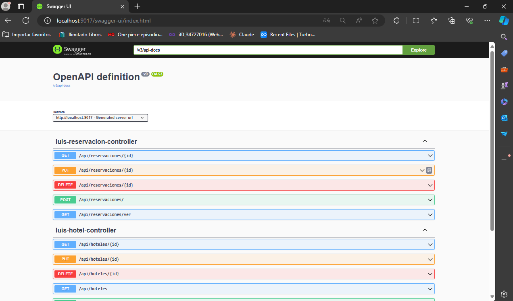

# examen
5to semestre

imagen swagger 

metodo GET
http://localhost:9017/api/citas/citas

metodo POST

  {
  "numero_habitacion": 5,
  "fecha_ingreso": "2024-05-22T04:29:42.725Z",
  "disponible": true,
  "nombre_cliente": "prueba2"
  }

metodo DELETE
